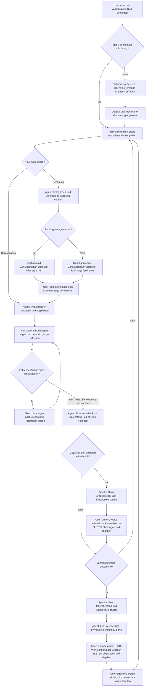

# User Journey: Von der Installation bis zum Jahresabschluss

Du installierst `euer`, richtest deinen KI-Buchhalter einmal ein und übergibst ihm
anschließend Rechnungen und Kontoauszüge. Der Agent erfasst und vervollständigt die
Buchungen, hält Rückfragen fest und erstellt Auswertungen. Du lieferst die Unterlagen,
klärst unklare Vorgänge, prüfst die Ergebnisse und überträgst die Werte selbst nach
ELSTER. Die Berichte unterstützen dich dabei mit jahresbezogenen EÜR-Zeilennummern
für mitgelieferte Formularjahre beziehungsweise
UStVA-Kennzahlen; Exporte machen die zugrunde liegenden Buchungen kontrollierbar.

Diese Journey beschreibt den vorhandenen Funktionsumfang. Die Beispieljahre und
Zeiträume ersetzt du durch deine eigenen. Alle CLI-Befehle nach der Installation
kann auch dein lokal arbeitender Agent ausführen.

## Der Ablauf auf einen Blick



## 1. Installieren und den Arbeitsplatz vorbereiten

**Dein Ziel:** Der spätere Agent kann im Terminal `euer` aufrufen und auf deinen
Buchhaltungsordner zugreifen.

Installiere gemäß [User Guide](USER_GUIDE.md#installation), beispielsweise mit
`pipx install euer` oder auf macOS/Linux mit `brew install curiousmarkus/euer/euer`.
Für Excel-Exporte gibt es bei pipx das Extra `pipx install "euer[xlsx]"`.
Prüfe die Installation mit `euer --version` und `euer --help`.

Lege einen eigenen Buchhaltungsordner fest. Hier liegen später deine persönliche
`AGENTS.md` und standardmäßig die Datenbank `euer.db`. Das ist dein Arbeitsordner,
unabhängig vom Quellcode-Repository und dessen Entwickler-`AGENTS.md`.

Du brauchst außerdem eine KI-Anwendung mit Terminal- und Dateizugriff. Ein normaler
LLM-Chat reicht für das Interview; für das tatsächliche Buchen muss der Agent die
CLI ausführen und die Unterlagen lesen können. `euer` speichert die Buchhaltungsdaten
lokal. Welche Inhalte deine KI-Anwendung an einen Modellanbieter sendet, hängt von
dieser Anwendung ab.

## 2. Das Onboarding-Interview durchführen

Installiere den vollständigen [Buchhaltungs-Skill](skills/euer-buchhaltung/SKILL.md)
**einschließlich `references/`** in deiner KI-Anwendung (Einbindung siehe Schritt 3).
Starte den Agenten im Buchhaltungsordner und sage:

> Richte meine Buchhaltung mit euer ein. Prüfe zuerst, was schon vorhanden ist.

Der Agent prüft Mandanten-Dossier, Datenbank und Config. Fehlt etwas, lädt er den
[Onboarding-Leitfaden](skills/euer-buchhaltung/references/onboarding.md) und fragt
nur die fehlenden Angaben ab. Bei vollständiger Einrichtung kann er direkt buchen.
Das Interview klärt nach Bedarf:

1. Mandant, Geschäftsform, EÜR-Nutzung und Beginn der Buchhaltung.
2. Umsatzsteuerstatus und weitere steuerliche Rahmenbedingungen.
3. Belegablage, Dateinamen, Exportordner und PDF-Werkzeug.
4. Geschäftliche und private Konten, private Auslagen und gemischte Nutzung.
5. Wiederkehrende Zuordnungen, optionale Buchungskonten, Monatsabgleich und Sicherung.

Der Agent fasst die Angaben zusammen, klärt offene Entscheidungen und erstellt oder
ergänzt deine persönliche **`AGENTS.md` als Mandanten-Dossier**. Bei einem lokalen
Einrichtungsauftrag übernimmt er auch die passenden Setup-Schritte. Bestehende
Dateien und individuelle Regeln bleiben erhalten. Er prüft den tatsächlichen Stand;
eine beliebige vorhandene `AGENTS.md` oder ein gesetztes Status-Flag genügt nicht.

**Optionaler Weg ohne lokalen Agenten:** Verwende den
[Onboarding-Prompt](templates/onboarding-prompt.md) in einem separaten LLM-Chat.
Dieser nutzt denselben Leitfaden und liefert Dossier plus Setup-Befehle. Speichere
und führe diese anschließend lokal aus. Der Chat kann ohne Zugriff auf deinen
Rechner die technische Einrichtung nicht prüfen.

**Ergebnis:** Ein Mandanten-Dossier und eine geprüfte lokale Einrichtung – oder,
beim separaten Chat, vorbereitete Dateien und Befehle mit noch offener lokaler Prüfung.

## 3. Den KI-Buchhalter startklar machen

Richte in deiner KI-Anwendung die drei Bestandteile ein:

| Bestandteil | Aufgabe |
|---|---|
| Persönliche `AGENTS.md` | Deine Konten, Pfade, steuerlichen Stammdaten und individuellen Regeln |
| [accountant-agent.md](templates/accountant-agent.md) | Rolle und Arbeitsablauf des KI-Buchhalters |
| [Skill euer-buchhaltung](skills/euer-buchhaltung/SKILL.md) inklusive `references/` | Einrichtung, CLI-Bedienung und Buchungsregeln |

Die Art der Einbindung hängt von deiner KI-Anwendung ab. Die Installation des
Python-Pakets richtet diese Agenten-Dateien nicht automatisch ein. Stelle sicher,
dass der Agent Skill und Referenzen sowie ein vorhandenes Dossier tatsächlich lesen kann.
Bei einer Ersteinrichtung entsteht das Dossier erst im Interview. Für Rechnungen und Kontoauszüge
braucht er zusätzlich PDF-Textextraktion, etwa `markitdown`, und bei Scans eine
OCR- oder Bildlesefunktion. Diese Verarbeitung übernimmt der Agent außerhalb von `euer`.

Falls noch nicht vom Agenten erledigt, führe im Buchhaltungsordner `euer init`
und die Setup-Befehle aus dem Interview aus; alternativ führt `euer setup`
interaktiv durch die Konfiguration. Danach prüft
der Agent:

```bash
euer config show
euer list categories
euer list ledger-accounts
euer incomplete list
```

Die Config liegt unter macOS/Linux in `~/.config/euer/config.toml`, unter Windows
in `%APPDATA%\euer\config.toml`. Sie ist nicht automatisch auf den Arbeitsordner
beschränkt. Die Datenbank wird dagegen standardmäßig im aktuellen Arbeitsordner
gesucht. Bei Bedarf wählt der Agent sie explizit mit
`euer --db "/pfad/zur/euer.db" …` aus.

**Erster Auftrag:**

> Lies mein Mandanten-Dossier, den Buchhalter-Agenten und den euer-Skill. Prüfe
> Datenbankpfad, Konfiguration, Belegablage und vorhandene Buchungen. Sage mir,
> welche Unterlagen für den Einstieg noch fehlen.

Bei einem Einstieg mitten im Jahr gehört dazu der Abgleich mit den bisherigen
Buchungen. Schon erfasste Belege und Zahlungen dürfen nicht erneut angelegt werden.
Vereinbare außerdem eine Sicherung von Datenbank, Config, Dossier und Belegdateien.

## 4. Die erste Rechnung übergeben

> Erfasse diese Rechnung. Prüfe zuerst, ob sie schon gebucht ist. Wenn der
> Zahlungsnachweis fehlt, halte das offen und sage mir, was du noch brauchst.

Der Agent prüft zuerst vorhandene und unvollständige Buchungen. Dann liest er
Lieferant, Rechnungsdatum, Betrag, Währung, Leistungsbeschreibung und Steuerangaben
aus dem Beleg. Er ordnet die Kategorie zu und prüft gegebenenfalls Reverse Charge,
private Zahlung oder einen betrieblichen Anteil. Unklare Angaben fragt er nach.

**Rechnung vorhanden, Zahlung noch nicht nachgewiesen:** Eine Erfassung mit
`invoice_date` ohne `payment_date` ist möglich. Sie bleibt unvollständig und fließt
noch nicht in `summary` oder `vat-report` ein. Mindestens eines der beiden Daten
muss vorhanden sein. Bei Fremdwährung ohne belastbaren EUR-Betrag bleibt die
Erfassung als Rückfrage offen; der Agent erfindet keinen Umrechnungskurs.

Beispiel für eine inländische Ausgabe bei Regelbesteuerung:

```bash
euer add expense --invoice-date 2026-09-18 --vendor "Beispiel Hosting GmbH" \
  --category "Laufende EDV-Kosten" --amount -119.00 --vat 19.00 \
  --receipt "2026-09-18_Beispiel-Hosting.pdf"
```

Ist die Zahlung nachgewiesen, trägt der Agent das Zahlungsdatum und bei Ausgaben
die Konto-Kennung ein. `euer` verwendet `payment_date` für seine zeitlichen
Auswertungen; der Agenten-Workflow entnimmt dieses Datum dem Kontoauszug.
Das Rechnungsdatum bleibt separat erhalten.

Der Agent legt den Beleg nach deinen Regeln ab und verknüpft ihn über seinen
Dateinamen. Im Standardlayout lautet der Pfad
`<Beleg-Root>/<Zahlungsjahr>/Ausgaben/<Dateiname>`, für Einnahmen entsprechend
`Einnahmen`. Ohne Zahlungsdatum wird bei der Belegprüfung das Rechnungsjahr als
Ersatz verwendet. Erfolgt die Zahlung im Folgejahr, muss der Agent auch die
Belegablage prüfen und gegebenenfalls ins Zahlungsjahr verschieben.

**Dein Ergebnis:** Eine Rückmeldung mit Buchungs-ID, Betrag, Kategorie, Belegpfad
und Zahlungsstatus sowie einer konkreten Liste fehlender Angaben.

## 5. Im Alltag Belege und Einnahmen sammeln

Du kannst einzelne Rechnungen oder ganze Stapel übergeben. Auch deine
Ausgangsrechnungen gehören dazu: Der Agent erfasst sie als Einnahmen und ergänzt
den Zahlungseingang später. Eine Rechnung allein belegt noch keinen Zahlungseingang.

| Situation | Vorgehen des Agenten |
|---|---|
| Zahlung und Rechnung vorhanden | Vorhandene Buchung ergänzen oder neue vollständige Buchung anlegen |
| Zahlung vorhanden, Rechnung fehlt | Zahlung erfassen, Beleg und weitere fehlende Angaben anfordern |
| Rechnung vorhanden, Zahlung fehlt | Ohne Zahlungsdatum erfassen, Zahlungsstatus offenhalten |
| Betriebsausgabe privat bezahlt | Privates Konto bzw. `--private-paid` verwenden; Sacheinlage berücksichtigen |
| Privateinlage oder Privatentnahme | Als eigenen Privatvorgang erfassen, getrennt von Betriebseinnahmen/-ausgaben |
| Geschäftlicher Bewirtungsbeleg | Gesamten Zahlbetrag inklusive Trinkgeld erfassen; belegte abziehbare Vorsteuer und Prüfstatus festhalten (siehe unten) |
| Fremdwährung | Tatsächlichen EUR-Zahlbetrag verwenden, Originalbetrag zusätzlich dokumentieren |
| Teilzahlung, Sammelzahlung, Erstattung oder unklare Zuordnung | Sachverhalt klären und Aufteilung dokumentieren; keinen ungeprüften Standardfall unterstellen |

Korrekturen erfolgen über `euer update`; die CLI protokolliert Änderungen im
Audit-Log. Wiederkehrende Regeln, die sich aus deinen Korrekturen ergeben, kann der
Agent zur Ergänzung deiner persönlichen `AGENTS.md` vorschlagen.

### Einen geschäftlichen Bewirtungsbeleg übergeben

> Erfasse diesen Bewirtungsbeleg samt Zahlungs- und Trinkgeldnachweis. Prüfe,
> ob er schon gebucht ist und ob Angaben zur Bewirtung oder Vorsteuer fehlen.

Du stellst die Rechnung, den Zahlungsnachweis und die Angaben zu Anlass und
Teilnehmern bereit; gegebenenfalls auch den Trinkgeldnachweis. Der Agent prüft,
ob der Vorgang in die Kategorie `Bewirtungsaufwendungen` gehört. Eine Bewirtung
nur eigener Arbeitnehmer fällt nicht unter diesen Workflow.

Beispiel bei Regelbesteuerung: Bezahlt wurden insgesamt 129,00 EUR, darin sind
10,00 EUR freiwilliges Trinkgeld enthalten. Die Rechnung weist 19,00 EUR
abziehbare Vorsteuer aus. Der Agent übernimmt den tatsächlichen Vorsteuerbetrag
vom geprüften Beleg; er rechnet ihn nicht pauschal aus dem Zahlbetrag zurück.

```bash
euer add expense --invoice-date 2026-09-18 --payment-date 2026-09-18 \
  --vendor "Beispielrestaurant" --category "Bewirtungsaufwendungen" \
  --amount -129.00 --vat 19.00 --tip 10.00 --account g-geschaeftskonto \
  --receipt "2026-09-18_Beispielrestaurant.pdf"
```

Das Konto ersetzt du durch deine eigene Konto-Kennung. `--tip` beschreibt einen
bereits im Zahlbetrag enthaltenen Anteil. Der Agent legt weder eine zweite
Trinkgeldbuchung noch eigene 70-%-/30-%-Buchungen an. `summary` berechnet aus
110,00 EUR Kostenbasis 77,00 EUR abziehbaren und 33,00 EUR nicht abziehbaren
Aufwand. Die 19,00 EUR Vorsteuer erscheinen zusätzlich als eigene EÜR-Ausgabe;
die gesamte Ausgabenwirkung beträgt hier 96,00 EUR. Ohne Vorsteuerabzug im
Kleinunternehmermodus sind es 90,30 EUR abziehbar und 38,70 EUR nicht abziehbar.

Fehlt bei Regelbesteuerung die belegte Vorsteuerbehandlung, lässt der Agent `--vat`
weg: Die Buchung erhält `needs_review`. `--vat 0` ist nur für einen geprüften
fehlenden Vorsteuerabzug gedacht. Nach der Klärung ergänzt er die bestehende
Buchung, beispielsweise mit `euer update expense <ID> --vat 19.00 --tip 10.00`.
`euer incomplete list` und die erneute Jahresauswertung zeigen den Folgestand.
Ein gespeicherter Vorsteuerstatus ersetzt nicht die fachliche Belegprüfung.

Bewirtungs-Erstattungen und Bewirtung mit Reverse Charge sind derzeit nicht
unterstützt. Der Agent hält sie zur gesonderten Klärung offen. Weitere Antworten
stehen in den [Bewirtungs-FAQ](FAQ.md#4-wie-buche-ich-einen-bewirtungsbeleg-mit-trinkgeld).

## 6. Zum Monatswechsel die Konten abgleichen

**Dein Beitrag:** Stelle die vollständigen Kontoauszüge des vergangenen Monats
bereit, außerdem relevante Kreditkarten-/Zahlungsdienstleister-Abrechnungen und
Nachweise über privat bezahlte Betriebsausgaben. Reiche fehlende Rechnungen nach.
Ein Monatswechsel startet in `euer` keinen automatischen Abruf oder Agentenlauf;
du stößt den Abgleich an oder richtest dafür außerhalb der CLI eine Erinnerung ein.

> Gleiche September 2026 mit diesen Kontoauszügen ab. Ergänze vorhandene
> Buchungen, erfasse fehlende Vorgänge und liste alle ungeklärten Differenzen auf.
> Berücksichtige auch offene Rechnungen aus früheren Monaten.

Der Agent arbeitet den Zeitraum in dieser Reihenfolge durch:

1. Bisherigen Stand und `euer incomplete list` prüfen, einschließlich älterer Fälle.
2. Auszüge auslesen: Zeitraum, Konto, Transaktionen, Zahlungsdaten und EUR-Beträge.
3. Jede Bewegung bestehenden Buchungen und Belegen zuordnen. Betrag, Gegenpartei
   und Referenzen prüfen; ein ähnlicher Betrag allein genügt nicht.
4. Bereits erfasste Rechnungen per `update` vervollständigen. Beispielsweise wird
   die ID aus Schritt 4 mit `euer update expense <ID> --payment-date 2026-09-21
   --account g-geschaeftskonto` ergänzt.
5. Fehlende Vorgänge per `add` oder normalisiertem CSV-/JSONL-Import erfassen.
   Bank-PDFs und beliebige Bank-CSV-Dateien sind kein direktes Importformat:
   Der Agent muss sie zuerst in das Schema aus `euer import --schema` überführen.
6. Private Bewegungen und Umbuchungen gesondert zuordnen. Insbesondere dürfen
   Kreditkartenabrechnung und zugehörige Kontobelastung keine doppelten Kosten erzeugen.
7. Vollständigkeit und Belegpfade prüfen, Rückfragen stellen und nach deinen
   Antworten erneut abgleichen.

```bash
euer list expenses --year 2026 --month 9 --full
euer list income --year 2026 --month 9 --full
euer incomplete list
euer receipt check --year 2026
```

Der Import hat einen Duplikatschutz, ersetzt aber nicht den fachlichen Abgleich
mit einer schon angelegten Rechnung. Auch eine leere Incomplete-Liste beweist
nicht, dass jede Kontobewegung erfasst wurde. Der Agent sollte deshalb berichten,
welche Konten und Zeiträume vollständig abgeglichen sind und welche noch fehlen.

**Ergebnis:** Der Monatsbestand ist abgeglichen oder ausdrücklich vorläufig.
Offene Punkte nennen jeweils Vorgang/Buchungs-ID, fehlende Information und deinen
nächsten Schritt. Das ist ein Arbeitsstand, keine technische Periodensperre.

## 7. Den aktuellen Finanzüberblick erhalten

> Zeige mir Einnahmen, Ausgaben und Ergebnis für September sowie den bisherigen
> Jahresstand. Nenne unbezahlte Rechnungen, fehlende Belege und den Stand des Abgleichs.

`euer summary --year 2026` liefert die Jahresauswertung nach Kategorien mit
Gewinn/Verlust und Steuerinformationen. Bei ungeprüften Bewirtungen werden
vorläufige Teilwerte und ein unvollständiger Zwischensaldo ausgewiesen; der Agent
darf diesen nicht als abschließenden Gewinn darstellen. Eine Monatsoption gibt es für `summary`
nicht. Für Monatszahlen nutzt der Agent die gefilterten Listen oder lesende
Abfragen über `euer query` und benennt die Berechnungsgrundlage.

Ein nützlicher Bericht enthält:

- Einnahmen, Ausgaben und Ergebnis für den gewünschten Zeitraum und das Jahr.
- Unbezahlte bzw. noch nicht als bezahlt nachgewiesene Rechnungen separat.
- Privateinlagen und -entnahmen bei Bedarf über `private-summary`.
- Steuerinformationen und gegebenenfalls den UStVA-Arbeitsbericht.
- Datenstand je Konto, offene Fragen und noch nicht erfasste Unterlagen.

Das Buchungsergebnis ist kein Kontostand und kein frei verfügbares Guthaben.
Für eine Liquiditätsübersicht braucht der Agent zusätzlich belegte Kontostände
und bekannte künftige Zahlungen. Fehlende Zahlungsdaten werden in den genannten
Jahres- und UStVA-Auswertungen ausgeschlossen; andere fehlende Angaben können
weiterhin zu unvollständigen oder fachlich falschen Ergebnissen führen.

## 8. Falls erforderlich: UStVA vorbereiten und abgeben

Nach dem Abgleich des für dich geltenden Voranmeldungszeitraums erstellt der Agent
einen Arbeitsbericht, beispielsweise monatlich **oder** quartalsweise:

```bash
euer vat-report --year 2026 --month 9
euer vat-report --year 2026 --quarter 3 --format csv --output exports/2026-Q3
```

Der Bericht enthält ELSTER-Kennzahlen, Zahllast/Erstattung und Warnungen. Beim
CSV-Export entsteht zusätzlich eine Diagnose-Datei; XLSX ist optional verfügbar.
Bei Bewirtungen wird die belegte abziehbare Vorsteuer nicht auf 70 % gekürzt.
Ein Diagnosehinweis zu `needs_review` bleibt auch dann zu klären, wenn schon ein
vorläufiger Vorsteuerbetrag im Bericht enthalten ist.
Der Agent klärt fehlende Steuerklassifikationen und ausgeschlossene Buchungen,
bevor du die Werte verwendest. Kleinunternehmer sollten Umsatzsteuerthemen nicht
pauschal überspringen: Auch sie können etwa bei Reverse Charge betroffen sein.
Maßgeblich sind die [ELSTER-Hinweise zur UStVA 2026](https://www.elster.de/eportal/helpGlobal?themaGlobal=help_ustva_2026).

**Wichtige Produktgrenze:** `vat-report` ordnet ausschließlich nach Zahlungsdatum
zu. Daraus folgt keine automatische Eignung für jede umsatzsteuerliche
Periodenzuordnung. Insbesondere Soll-/Istbesteuerung, Zeitpunkt des Vorsteuerabzugs
und Reverse-Charge-Sachverhalte müssen anhand deiner Situation geprüft werden;
die [ELSTER-Anleitung](https://www.elster.de/eportal/helpGlobal?themaGlobal=help_ustva_2026)
beschreibt die jeweiligen Anforderungen.

Du prüfst den Bericht und seine Diagnose. Nutze bei Bedarf zusätzlich den
Buchungsexport als CSV oder Excel, um Einzelbuchungen mit Belegen und Kontoauszügen
abzugleichen. Anschließend kopierst du die geprüften Werte anhand der angegebenen
Kennzahlen in die passenden ELSTER-Felder, prüfst die Eingaben und sendest die
Voranmeldung ab. Gegebenenfalls veranlasst du die Zahlung.

`euer` übermittelt keine Anmeldung und
führt keine Überweisung aus. UStVA und EÜR sind grundsätzlich elektronisch zu
übermitteln; ein lokaler Export ist noch keine Abgabe.
Siehe [ELSTER: Rechtliches](https://www.elster.de/eportal/infoseite/rechtliches).
Bewahre das Übermittlungsprotokoll auf. Tatsächliche Steuerzahlungen oder
Erstattungen werden beim späteren Kontoabgleich ebenfalls erfasst.

## 9. Zum Jahreswechsel die EÜR prüfen und in ELSTER übertragen

Der Jahresabschluss beginnt mit dem letzten Monatsabgleich. Du stellst zusätzlich
die Unterlagen rund um den Jahreswechsel bereit, damit ausstehende Zahlungen und
jahresübergreifende Fälle geklärt werden können.

> Bereite die EÜR 2026 vor. Prüfe alle Konten und Belege, zeige offene Fälle und
> jahresübergreifende Zahlungen. Erstelle anschließend die Jahresauswertung und
> Exporte und nenne, was vor der Steuererklärung noch geprüft werden muss.

Der Agent prüft den Jahresbestand einschließlich Privatvorgängen und gleicht
Steuerzahlungen/-erstattungen ab. Anlagegüter, Abschreibungen, gemischte Nutzung
und andere Sonderfälle werden gesondert geklärt. Die CLI kategorisiert und summiert
Buchungen; dadurch ist noch nicht jede steuerliche Abschlusskorrektur erledigt.

Die Jahresauswertungen von `euer` folgen dem Zahlungsdatum. Für regelmäßig
wiederkehrende Zahlungen rund um den Jahreswechsel sieht
[§ 11 EStG](https://www.gesetze-im-internet.de/estg/__11.html) Ausnahmen vor.
Diese werden nicht automatisch durch den Jahresfilter gelöst und gehören in die
fachliche Prüfung. Das tatsächliche Zahlungsdatum sollte dafür nicht verfälscht werden.

```bash
euer incomplete list
euer receipt check --year 2026
euer summary --year 2026 --include-private
euer private-summary --year 2026
euer export --year 2026 --format csv --output exports/2026
```

Bei Bedarf kommt `euer vat-report --year 2026` als jährliche Kontrollauswertung
hinzu. Es ersetzt weder die Umsatzsteuer-Jahreserklärung noch die einzelnen UStVA.
Vor dem Abschluss klärt der Agent insbesondere alle Bewirtungen mit
`needs_review`, gleicht Zahlbetrag, Trinkgeld und Vorsteuer mit dem Beleg ab und
kontrolliert die getrennten abziehbaren/nicht abziehbaren Beträge. Der 30-%-Anteil
wird nicht zusätzlich als Privatentnahme gebucht.

Auch Kategorie-/Zeilenzuordnungen müssen zum Formularjahr passen:
`euer list categories --year 2026` zeigt die mitgelieferte Zuordnung. Für unbekannte
Jahre gibt die CLI keine Zeilennummern vor; der Agent kennzeichnet den fehlenden
Formularabgleich. Neue Zuordnungen kommen derzeit über ein Paketupdate, nicht
über einen automatischen Online-Abruf. Die 2026-Zuordnung ist anhand der
BMF-Unterlagen hinterlegt; dies ist keine Bestätigung einer geprüften Live-Maske
in Mein ELSTER. Prüfe dort stets Formularjahr, Feldbezeichnung und Teilfeld.

**Du erhältst:** Jahresauswertung mit verfügbaren EÜR-Zeilennummern, Buchungsexporte,
Privatübersicht, Belegbestand und eine Liste verbleibender Abschlussfragen.
Damit erledigst du den Abschluss selbst:

1. Prüfe die Auswertung und kläre offene Punkte mit deinem Agenten. Nutze den
   CSV-/Excel-Export, um die Einzelbuchungen und Kategoriezuordnungen mit deinen
   Unterlagen abzugleichen. Nach Korrekturen lässt du die Berichte neu erstellen.
2. Öffne die Anlage EÜR für das passende Jahr in ELSTER. Übertrage die geprüften
   Werte per Copy-and-paste anhand der im Bericht angegebenen Zeilennummern in die
   entsprechenden Felder; gleiche dabei auch die Feldbezeichnungen ab. Fehlt die
   Jahreszuordnung, muss die Zuordnung anhand der amtlichen Jahresunterlagen
   zuerst geprüft werden. Abziehbare und nicht abziehbare Bewirtung sind getrennte
   Teilfelder derselben Zeile.
3. Ergänze weitere erforderliche Angaben, prüfe die Eingaben und die
   ELSTER-Prüfmeldungen und sende die Erklärung ab. Bewahre das Übermittlungsprotokoll auf.

Die Berichte und Exporte liefern die Grundlage; Prüfung und Abgabe erledigst du
direkt in ELSTER. Weitere erforderliche Jahreserklärungen bearbeitest du ebenfalls dort.

Im neuen Jahr arbeitest du mit derselben Datenbank weiter; ein jährliches Löschen
oder Zurücksetzen ist nicht nötig. Neue Belege kommen in die passenden
Jahresordner. Für Exporte setzt du einen konkreten Jahrespfad: `exports.directory`
unterstützt keinen `{year}`-Platzhalter.

## 10. Sichern, aktualisieren und Regeln pflegen

Sichere regelmäßig die Datenbank sowie Belege, Kontoauszüge, Config, persönliche
`AGENTS.md` und Abgabeprotokolle. Eine einfache Dateikopie der Datenbank sollte nur
bei beendeten Schreibzugriffen erfolgen; bei laufendem Zugriff ist eine konsistente
SQLite-Sicherung erforderlich. CSV-/XLSX-Exporte ersetzen kein vollständiges Backup.

Vor Updates liest du die [Release Notes](RELEASE_NOTES.md). Nach dem Paketupdate
führst du im richtigen Buchhaltungsordner `euer init` für eventuelle Migrationen
und anschließend die dort beschriebenen Prüfungen aus. Lokal kopierte Skills und
Agenten-Vorlagen müssen gegebenenfalls separat aktualisiert werden. Dein
persönliches Dossier bleibt erhalten und wird gezielt angepasst.

Beim Bewirtungs-Upgrade bleiben historische Beträge und Vorsteuerwerte erhalten;
`euer init` markiert bisherige Bewirtungen ohne Einzelstatus als `needs_review`.
Der Agent prüft diese am jeweiligen Beleg und berücksichtigt den damaligen
Vorsteuerabzug. Ein späterer Wechsel des globalen Steuermodus entscheidet nicht
über die Behandlung alter Buchungen. Anschließend erstellt er betroffene Berichte
und Exporte neu.

## Vorhandene Funktionen und offene Erweiterungen

| Heute nutzbar | Aufgabe des Agenten oder noch offen |
|---|---|
| Lokale Buchungen, Updates und Audit-Log | PDF/OCR-Auslesen und fachliche Zuordnung übernimmt der Agent |
| CSV-/JSONL-Import | Bankformate müssen zuerst normalisiert werden; kein automatischer Bankabruf |
| `incomplete list` und `receipt check` | Erfassen fehlende Felder bzw. fehlende Dateien zu Buchungen; kein vollständiger Kontoabgleich |
| Belegpfade zu vorhandenen Buchungen prüfen | Nicht eingebuchte Dateien erkennen: [Spec 017](../specs/017-nicht-eingebuchte-belege.md), offen |
| Terminalauswertungen und CSV-/XLSX-Exporte | HTML-Prüfbericht: [Spec 014](../specs/014-html-pruefbericht.md), offen |
| Auditierte Änderungen | Automatische Snapshots, Soft-Delete und Undo: [Spec 016](../specs/016-agent-safety-und-guardrails.md), offen |
| UStVA-Arbeitsbericht und EÜR-Zusammenfassung | Fachliche Abschlussprüfung, Fristenorganisation und ELSTER-Abgabe erfolgen außerhalb der CLI |

## Grundlage dieser Journey

Der Ablauf wurde mit dem [Onboarding-Prompt](templates/onboarding-prompt.md),
dem [Agenten-Template](templates/accountant-agent.md), dem
[Buchhaltungs-Skill](skills/euer-buchhaltung/SKILL.md) und dem
[User Guide](USER_GUIDE.md) abgeglichen. Die technischen Grenzen wurden im
[CLI-Parser](../euercli/cli.py), in der
[Jahresauswertung](../euercli/commands/summary.py), der
[Belegprüfung](../euercli/commands/receipt.py) und dem
[UStVA-Service](../euercli/services/vat_report.py) geprüft.
Die verlinkten amtlichen Quellen ergänzen die Hinweise zu Abgabe und steuerlichen
Grenzen; Recherche-Stand: 23. September 2026.
