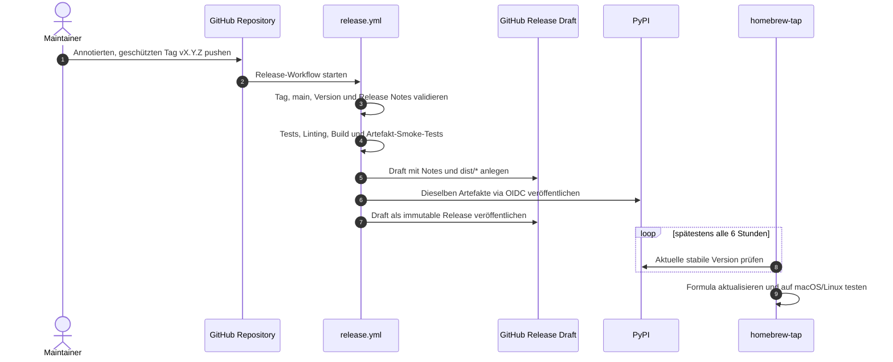

# 015 - Multi-Channel-Distribution (PyPI, GitHub Releases, Homebrew)

## Status

Offen

Die Repository-Implementierung ist vorbereitet und lokal verifiziert. Die in
`DEVELOPMENT.md` dokumentierten externen Maintainer-Schritte (PyPI Trusted Publisher,
GitHub-Settings und separates Homebrew-Tap-Repository) sind noch offen; deshalb bleibt
der Spec-Status bis zu deren Nachweis `Offen`.

## Kontext

`euer` wird derzeit direkt aus dem GitHub-Repository via
`pipx install git+https://github.com/curiousmarkus/euer.git` installiert. Das ist für
die frühe Entwicklungsphase funktional, für Anwender:innen aber mit Hürden verbunden:

- Umständliche und lange Installationsbefehle.
- Keine direkte Installation des optionalen Extras `[xlsx]` (`pipx inject` erforderlich).
- Keine native Integration in Paketmanager wie Homebrew.
- Zeitaufwändiger Download des gesamten Git-Repositorys bei jeder Installation.
- Installationen von `main` sind keinem unveränderlichen Release eindeutig zugeordnet.

Die Distribution wird deshalb einmalig als durchgängiger, weitgehend wartungsfreier
Release-Prozess für drei Kanäle aufgebaut:

1. **PyPI** als kanonischer Paket- und Artefaktkanal (`pipx install euer`).
2. **GitHub Releases** als Release-Hub mit Release Notes und denselben Build-Artefakten.
3. **Homebrew Tap** als komfortabler Installationsweg für macOS und Linux.

### Namensfestlegung: Nur `euer`

Der offizielle Distributionsname auf PyPI und Homebrew lautet verbindlich **`euer`**.

- CLI-Befehl und Repository heißen bereits `euer`.
- `euercli` wird als Distributionsname abgelöst, um die Unterscheidung zwischen
  Installations- und Aufrufnamen zu beseitigen.
- Der interne Python-Paketordner bleibt `euercli/`; der Entry Point bleibt
  `euer = "euercli.cli:main"`.
- Der Wechsel des Distributionsnamens ist eine nutzerwirksame Änderung und wird als
  Migration dokumentiert.

Der erste Multi-Channel-Release ist **`0.8.0`**. Der Release `0.7.1` bleibt davon
getrennt der Windows-Bugfix unter dem bisherigen Distributionsnamen.

## Ziel

Nach der einmaligen Einrichtung ist das Erstellen und Pushen eines geschützten,
annotierten Git-Tags `vX.Y.Z` der einzige reguläre manuelle Veröffentlichungsschritt.

Der Tag stößt eine abgesicherte Pipeline an, die:

1. Release-Metadaten, Tests und Paketinhalt validiert,
2. Wheel und Source Distribution genau einmal baut,
3. exakt diese Artefakte über Trusted Publishing auf PyPI veröffentlicht,
4. ein GitHub Release mit den kanonischen Release Notes und denselben Artefakten
   veröffentlicht und
5. vom separaten Homebrew Tap automatisch innerhalb eines definierten Zeitfensters
   erkannt und übernommen wird.

PyPI und GitHub Releases werden unmittelbar beliefert. Homebrew ist bewusst
**eventuell konsistent** und übernimmt neue PyPI-Releases spätestens innerhalb von
sechs Stunden. Eine transaktionsartige, gleichzeitige Veröffentlichung über drei
unabhängige Systeme wird nicht versprochen.

## Nicht-Ziele

- Keine Standalone-Binaries via PyApp, Shiv oder PyInstaller in dieser Phase; damit
  entsteht kein zusätzlicher Code-Signing-Overhead für macOS oder Windows.
- Keine manuellen Schritte pro Distributionskanal im regulären Release-Ablauf.
- Keine langlebigen PyPI-Passwörter oder API-Tokens.
- Kein repositoryübergreifender Personal Access Token für den Homebrew Tap.
- TestPyPI ist kein dauerhafter vierter Distributionskanal.
- Keine automatischen Releases allein durch Merge oder Commit auf `main`; ein
  geschützter Versionstag bleibt die bewusste Freigabeentscheidung.

## Verbindliche Release-Regeln

### Version und Tags

- Release-Tags entsprechen exakt `vMAJOR.MINOR.PATCH`, zum Beispiel `v0.8.0`.
- Der Release-Workflow prüft das Format zusätzlich, da der GitHub-Filter `v*` allein
  nicht streng genug ist.
- Der getaggte Commit muss Bestandteil von `main` sein.
- Für `v*` wird ein GitHub Ruleset eingerichtet, das Erstellen auf Maintainer
  beschränkt und Verschieben oder Löschen verhindert.
- Veröffentlichte Tags und Versionen werden nie wiederverwendet. Korrekturen erhalten
  immer eine neue PATCH-Version.
- Vorabversionen wie `rc`, `alpha` oder `beta` sind zunächst nicht Bestandteil des
  automatischen Produktionsworkflows.

### Eine kanonische Versionsquelle

Die Version wird nur noch als `VERSION` in `euercli/__init__.py` gepflegt.
`pyproject.toml` übernimmt sie über Setuptools Dynamic Metadata. Damit bleiben der
direkte Start aus einem Checkout und der bestehende CLI-Zugriff auf `VERSION` möglich,
ohne zwei Versionsstrings synchron pflegen zu müssen.

Das Bump-Skript ändert ausschließlich diese eine Quelle. Der Release-Check vergleicht:

- Tag ohne führendes `v`,
- `euercli.VERSION` und
- die Version in den Metadaten des gebauten Wheels und sdists.

### Kanonische Release Notes

`docs/RELEASE_NOTES.md` ist die einzige inhaltliche Quelle für Release Notes.

- Für `vX.Y.Z` muss genau ein nicht leerer Abschnitt `## X.Y.Z` existieren.
- Ein plattformunabhängiges Skript extrahiert diesen Abschnitt deterministisch.
- Der extrahierte Text wird unverändert als Beschreibung des GitHub Releases genutzt.
- Automatisch aus Commits oder Pull Requests generierte GitHub-Notes ersetzen diesen
  Text nicht.
- Fehlende, doppelte oder leere Versionsabschnitte brechen den Release vor dem
  Veröffentlichen ab.

## Distributionskanäle

### 1. PyPI – kanonischer Paket- und Artefaktkanal

- **Distributionsname:** `euer`
- **Installation:**

  ```bash
  pipx install euer
  pipx install "euer[xlsx]"
  ```

- **Artefakte:**
  - `euer-<version>-py3-none-any.whl`
  - `euer-<version>.tar.gz`
- **Authentifizierung:** GitHub Trusted Publishing via OIDC.
- **GitHub Environment:** `pypi`, verbindlich konfiguriert und auf geschützte
  Produktionstags beschränkt. Eine zusätzliche manuelle Freigabe ist nicht nötig;
  das Pushen des geschützten Tags ist die Freigabe.
- **Berechtigung:** `id-token: write` ausschließlich im PyPI-Publish-Job.
- **Attestierungen:** Die von `pypa/gh-action-pypi-publish` bei Trusted Publishing
  erzeugten digitalen Attestierungen bleiben aktiviert.
- **README:** Alle Bilder und Links, die PyPI nicht relativ zum Repository auflösen
  kann, verwenden stabile absolute GitHub-URLs.

Vor der Umsetzung wird geprüft, ob der Name `euer` auf PyPI verfügbar ist. Anschließend
wird ein Pending Trusted Publisher angelegt. Die Spec gilt erst als umsetzbar, wenn der
Name tatsächlich verfügbar ist; ein Pending Publisher reserviert ihn nicht.

### 2. GitHub Releases – Release-Hub

- **Trigger:** Push eines Tags `vX.Y.Z`.
- **Titel:** `euer X.Y.Z`.
- **Beschreibung:** extrahierter Abschnitt `X.Y.Z` aus
  `docs/RELEASE_NOTES.md`.
- **Assets:** exakt dasselbe Wheel und derselbe sdist wie beim PyPI-Upload.
- **Erstellung:** zunächst als Draft, damit Notes und alle Assets vollständig
  angehängt werden können.
- **Veröffentlichung:** erst nach erfolgreichem PyPI-Upload.
- **Integrität:** Immutable Releases werden im Repository aktiviert. Nach
  Veröffentlichung dürfen Tag und Assets nicht mehr verändert werden.

Die automatisch von GitHub erzeugten Repository-Quellarchive bleiben zusätzlich
verfügbar, gelten aber nicht als Python-sdist und werden nicht für PyPI oder Homebrew
verwendet.

### 3. Homebrew Tap – komfortabler Installationsweg

- **Repository:** `curiousmarkus/homebrew-tap`
- **Formula:** `Formula/euer.rb`
- **Installation:**

  ```bash
  brew install curiousmarkus/tap/euer
  ```

- **Quelle:** ausschließlich der auf PyPI veröffentlichte sdist samt SHA256; nicht das
  automatisch erzeugte GitHub-Quellarchiv.
- **Python:** Abhängigkeit von einer aktuell durch Homebrew unterstützten
  Python-Version, die `requires-python = ">=3.11"` erfüllt. Keine dauerhaft
  festgeschriebene Python-Minor-Version ohne Notwendigkeit.
- **Installation:** isolierte Homebrew-Umgebung via
  `virtualenv_install_with_resources`.
- **XLSX:** Die Homebrew-Formula enthält `openpyxl` und dessen transitive Python-
  Ressourcen standardmäßig. Damit stellt der komfortabelste Installationsweg alle
  CLI-Funktionen bereit; die normale PyPI-Basisinstallation bleibt dependency-frei.

#### Tokenlose Aktualisierung

Der Homebrew Tap wird nicht aus dem `euer`-Repository beschrieben. Stattdessen besitzt
er einen eigenen Workflow, der:

1. spätestens alle sechs Stunden die aktuelle stabile Version von `euer` auf PyPI
   abfragt,
2. eine noch nicht übernommene Version erkennt,
3. sdist, SHA256 und Python-Ressourcen aktualisiert,
4. `brew style`, `brew audit`, Installation und Formula-Test auf macOS und Linux
   ausführt und
5. die Änderung erst nach erfolgreichen Prüfungen mit dem eigenen `GITHUB_TOKEN` in
   das Tap-Repository übernimmt.

Dadurch sind weder ein repositoryübergreifender PAT noch ein GitHub-App-Schlüssel
erforderlich. Ein optionaler manueller `workflow_dispatch` darf ausschließlich der
sofortigen Wiederholung oder Diagnose dienen und ist kein regulärer Release-Schritt.

## Release-Architektur



## Release-Workflow und Fehlerbehandlung

### Jobs und Berechtigungen

Der Workflow besteht aus getrennten Jobs mit minimalen Rechten:

1. **validate** – `contents: read`
2. **test** – `contents: read`
3. **build** – `contents: read`; baut Wheel und sdist genau einmal
4. **verify-artifacts** – `contents: read`; prüft die hochgeladenen Build-Artefakte
5. **github-draft** – `contents: write`; legt den Draft an und lädt Assets hoch
6. **publish-pypi** – nur `id-token: write`; Environment `pypi`
7. **publish-github** – `contents: write`; veröffentlicht den vorhandenen Draft

Der Build-Job lädt Wheel und sdist als internes Workflow-Artefakt hoch. Alle
nachgelagerten Jobs laden exakt dieses Artefakt herunter; sie bauen nicht erneut.

Alle externen Actions werden auf vollständige Commit-SHAs gepinnt. Dependabot hält
diese Referenzen aktuell. Release-Läufe werden serialisiert und nicht automatisch
abgebrochen, damit zwei Versionen nicht gleichzeitig veröffentlicht werden.

### Artefaktprüfung

Vor einer externen Veröffentlichung werden mindestens folgende Prüfungen ausgeführt:

- `twine check dist/*` oder eine gleichwertige Prüfung von Metadaten und README.
- Wheel in einer frischen Umgebung installieren und `euer --version` ausführen.
- sdist in einer frischen Umgebung installieren und `euer --version` ausführen.
- `[xlsx]` aus dem Wheel installieren und einen XLSX-Export als Smoke-Test ausführen.
- Prüfen, dass die Basisinstallation `openpyxl` nicht als Pflichtabhängigkeit enthält.
- Prüfen, dass Wheel und sdist den Namen `euer`, dieselbe Version und den Entry Point
  `euer` enthalten.

Die bestehende Pull-Request-CI führt Build und Artefakt-Smoke-Tests ebenfalls aus,
damit Packaging-Fehler vor dem Setzen eines Release-Tags auffallen.

### Teilfehler und Wiederaufnahme

Eine atomare Transaktion über GitHub, PyPI und Homebrew ist nicht möglich. Deshalb
gelten folgende Regeln:

- PyPI-Versionen und veröffentlichte immutable GitHub Releases werden niemals ersetzt.
- Produktions-PyPI verwendet nicht pauschal `skip-existing`; unerwartete doppelte
  Uploads müssen sichtbar fehlschlagen.
- Nach einem Teilfehler werden nur fehlgeschlagene oder noch nicht gestartete Jobs
  desselben Workflow-Laufs wiederholt. Ein erfolgreicher PyPI-Job wird nicht erneut
  ausgeführt.
- Scheitert GitHub nach erfolgreichem PyPI-Upload, wird der vorhandene Draft mit den
  bereits gebauten Artefakten veröffentlicht.
- Scheitert die Homebrew-Aktualisierung, bleiben PyPI und GitHub gültig. Der Tap-
  Workflow versucht die noch nicht übernommene PyPI-Version beim nächsten Lauf erneut.
- `DEVELOPMENT.md` enthält einen kurzen Recovery-Runbook für diese Fälle.

## Migration von `euercli` zu `euer`

Bestehende Installationen aus dem GitHub-Repository besitzen den bisherigen
Distributionsnamen `euercli`. Ein normales `pipx upgrade euercli` kann den Wechsel auf
den neuen Namen nicht zuverlässig abbilden.

Die Release Notes für `0.8.0` dokumentieren deshalb verbindlich:

```bash
pipx uninstall euercli
pipx install euer
```

Für XLSX-Unterstützung gilt anschließend:

```bash
pipx install "euer[xlsx]"
```

Vor und nach der Umstellung wird geprüft, dass kein konkurrierender `euer`-Entry-Point
aus zwei pipx-Umgebungen übrig bleibt. Die lokale SQLite-Datenbank und Konfiguration
werden durch den Wechsel des Distributionsnamens nicht verändert.

## Umsetzungsplan

### Schritt 1: Release-Grundlagen

- [x] Verfügbarkeit des PyPI-Namens `euer` prüfen.
- [x] `euercli.VERSION` als einzige Versionsquelle einrichten und Setuptools Dynamic
      Metadata konfigurieren.
- [x] `scripts/bump-version.sh` und Packaging-Tests auf die einzelne Versionsquelle
      umstellen.
- [x] Plattformunabhängiges `scripts/release-check.py` implementieren.
- [x] `make release-check` ergänzen.
- [x] Release-Notes-Extraktion implementieren und testen.

### Schritt 2: Paket und Metadaten

- [x] In `pyproject.toml` den Distributionsnamen auf `euer` ändern.
- [x] `Documentation`- und `Changelog`-URLs in `[project.urls]` ergänzen.
- [x] README-Links und Bilder für die Darstellung auf PyPI stabilisieren.
- [x] Wheel und sdist bauen und deren Inhalt, Metadaten und Installation testen.
- [ ] Einmaliger Bootstrap-Test über TestPyPI mit einer dafür geeigneten Testversion;
      TestPyPI danach nicht als regulären Release-Kanal verwenden.

### Schritt 3: PyPI und GitHub konfigurieren

- [ ] Pending Trusted Publisher für `euer` konfigurieren:
  - Owner: `curiousmarkus`
  - Repository: `euer`
  - Workflow: `release.yml`
  - Environment: `pypi`
- [ ] GitHub Environment `pypi` auf Produktionstags beschränken.
- [ ] Ruleset für `v*`-Tags konfigurieren.
- [ ] Immutable Releases aktivieren.
- [x] Dependabot für GitHub Actions konfigurieren.

### Schritt 4: Release-Workflow

- [x] `.github/workflows/release.yml` mit den beschriebenen getrennten Jobs und
      minimalen Job-Berechtigungen erstellen.
- [x] Externe Actions auf vollständige Commit-SHAs pinnen.
- [x] Release-Läufe über `concurrency` serialisieren; `cancel-in-progress: false`.
- [x] Build-Artefakte genau einmal erzeugen und zwischen Jobs weitergeben.
- [x] GitHub-Draft vor dem PyPI-Publish erstellen und nach erfolgreichem Upload
      veröffentlichen.
- [ ] Recovery-Verhalten für Teilfehler praktisch testen.

### Schritt 5: Homebrew Tap

- [ ] Repository `curiousmarkus/homebrew-tap` anlegen.
- [ ] `Formula/euer.rb` auf Basis des PyPI-sdists erstellen.
- [ ] `openpyxl` und transitive Abhängigkeiten als Homebrew-Ressourcen aufnehmen.
- [x] Aussagekräftigen `test do`-Block einschließlich `euer --version` und XLSX-
      Smoke-Test ergänzen.
- [x] Tokenlosen Polling-Workflow im Tap vorbereiten.
- [ ] Formula-Aktualisierung, Wiederholung und Tests auf macOS und Linux prüfen.

### Schritt 6: Dokumentation und Migration

- [x] `README.md`: Homebrew, PyPI, XLSX-Extra und Git-Fallback dokumentieren.
- [x] `docs/USER_GUIDE.md`: Installation und Updates über `pipx upgrade euer` und
      `brew upgrade euer` dokumentieren.
- [x] `docs/RELEASE_NOTES.md`: Abschnitt `0.8.0` mit der einmaligen
      `euercli`-zu-`euer`-Migration ergänzen.
- [x] `DEVELOPMENT.md`: Tag-basierten Release-Prozess und Recovery-Runbook ergänzen.
- [x] `AGENTS.md`: Agenten verpflichten, Release-Check, Versionstag und unveränderliche
      Release Notes zu beachten.
- [x] Veraltete Befehle wie `pipx upgrade euercli` in aktiver Nutzerdokumentation
      ersetzen, ohne historische Release-Abschnitte nachträglich zu verändern.

## Akzeptanzkriterien

1. Ein geschützter, annotierter Tag `vX.Y.Z` auf `main` ist der einzige reguläre
   manuelle Release-Schritt.
2. Ungültiger Tag, abweichende Paketversion, fehlende Release Notes oder ein Commit
   außerhalb von `main` brechen den Workflow vor jeder externen Veröffentlichung ab.
3. Wheel und sdist werden genau einmal gebaut, vollständig geprüft und unverändert an
   PyPI und das GitHub Release weitergegeben.
4. Das Paket wird via OIDC ohne statischen PyPI-Token unter
   `https://pypi.org/project/euer/` veröffentlicht; digitale Attestierungen sind
   vorhanden.
5. Ein immutable GitHub Release existiert mit den aus
   `docs/RELEASE_NOTES.md` extrahierten Notes sowie Wheel und sdist.
6. `pipx install euer` installiert ausschließlich die dependency-freie Basis und
   `euer --version` liefert die Tag-Version.
7. `pipx install "euer[xlsx]"` installiert die XLSX-Unterstützung; ein realer
   XLSX-Smoke-Test ist erfolgreich.
8. Die Migration einer bestehenden pipx-Installation von `euercli` zu `euer` ist
   getestet und dokumentiert; Datenbank und Konfiguration bleiben erhalten.
9. Die README wird auf PyPI ohne gebrochene Bilder oder Dokumentationslinks gerendert.
10. Der Homebrew Tap erkennt einen neuen PyPI-Release automatisch spätestens innerhalb
    von sechs Stunden, ohne Token aus dem `euer`-Repository.
11. `brew install curiousmarkus/tap/euer` und `brew upgrade euer` funktionieren auf
    macOS und Linux; `euer --version` und ein XLSX-Smoke-Test sind erfolgreich.
12. Ein temporärer Fehler nach dem PyPI-Upload kann durch Wiederholen der betroffenen
    Jobs behoben werden, ohne Versionen oder bereits veröffentlichte Artefakte zu
    ersetzen.
13. Alle Workflow-Berechtigungen sind auf Job-Ebene minimal vergeben und alle externen
    Actions sind auf vollständige Commit-SHAs gepinnt.
